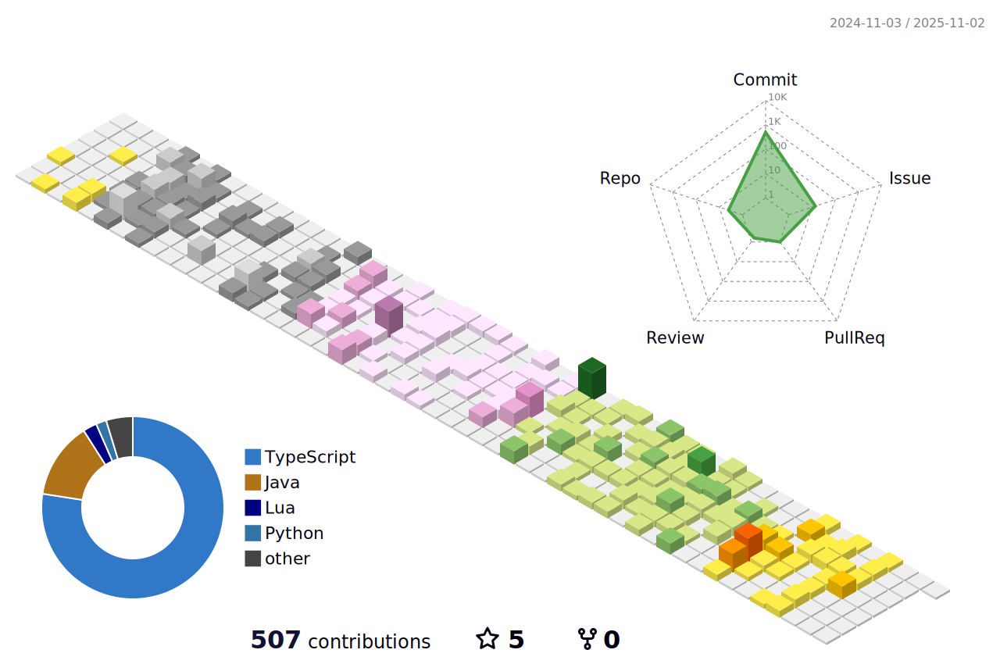

<h2 align="center">👋 Hello! I'm SmartDengC</h2>

  <a href="https://wiki.dengcong.org/">WIKI</a> •
  <a href="https://sci.dengcong.org/">SCI</a> •
  <a href="https://iron.dengcong.org/">IRON</a> •
  <a href="https://blog.csdn.net/weixin_41288824?spm=1000.2115.3001.5343">CSDN</a>

 
- 🔭 I’m currently working on <strong>low code platform</strong> in Chengdu now !!    
- 🌱 I’m currently learning new knowledge for the software designer exam !!    
- 💬 Ask me about <strong>Python, Java </strong>   
   
   

 👋 See through life laugh at life. 

 🤔 That's your best friend and your worst enemy - your own brain.

